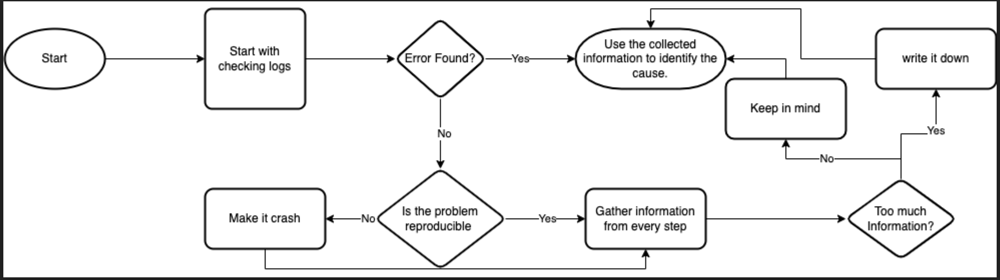

# How to identify the root cause for a bug?

## A Diagram of the process that we are about to go through

- [**Intro**](#intro)
- [**What is it?**](#what-is-it)
- [**What is it not?**](#what-is-it-not)
- [**Check the error log**](#check-the-error-log)
  - [**When error log is found**](#when-error-log-is-found)
    - **Use the information from the error log to fix the bug.**
  - [**When error log is not found**](#when-error-log-is-not-found)
    - [**When the error/bug is reproducible**](#when-the-errorbug-is-reproducible)
      - **Gather all the information while reproducing the bug**
      - **Use the information you gathered to fix the bug.**
    - [**When the error/bug is not reproducible**](#when-the-errorbug-is-not-reproducible)
      - [**Make it crash**](#make-it-crash)
        - **Gather all the information while reproducing the bug**
        - **Use the information you gathered to fix the bug.**

## Intro
Since there can be many approaches for finding and fixing a bug, each programmer uses his own approach, which can have different degrees of success.  
Therefore, we are going to explore the structure of a general bug-fixing process in which every programmer will know what he is doing and what he has already done.  

## What is it?
This is a structure that helps you answer two question:
1. **What** causes the bug?
2. **Why** the bug happened?

## What is it not?
- _Delve into syntax of any programing language._
- _A Solution for application performance or database performance issues._

## Check the error log
As programmers, We always save log for each error happens in our application.  
We also use different tools to check/filter them.  
No matter which tool you are using we will open it and check the related errors.  
We can find the related error by searching for an exception class, file name, error message or time frame.  
When you find the error message please jump to [**When error log is found**](#when-error-log-is-found) otherwise, please jump to [**When error log is not found**](#when-error-log-is-not-found)

## When error log is found
After reading the error message most likely you know now how to fix the bug.  
When not please jump to [**When error log is not found**](#when-error-log-is-not-found)

## When error log is not found
When you do not find an error this will be because of many reasons, for example
- A Try/catch statement which suppresses the error without logging it 
- The bug is logical.
- The log does not work for some issue
- The error is logged in the environment not the application (In this case check your environment logs)  

When you find an error but still do not know what to do then you need to collect more information about the process.  
Whether this or that, Now it's time to collect Information.  
As **Francis Bacon** said **knowledge is power.**  
It's time to collect information about the process.  
If the bug is reproducible please jump to [**When the error/bug is reproducible**](#when-the-errorbug-is-reproducible) otherwise jump to [**When the error/bug is not reproducible**](#when-the-errorbug-is-not-reproducible)

## When the error/bug is reproducible
In this case we will add debug message to every step of the process.  
Then we will repeat the process to reproduce the bug but this time we will collect all the information and details from every step in the process.  
Which means We will note everything. *input, debug messages, db changes, output or any unexpected behavior* during the process.  
*Debug messages, db changes and unexpected behavior* will allow you to have an understanding **WHERE** the application crashes or misbehave.  
While *input and output* will give an understanding about **WHY** the application crashes or misbehave.  
By knowing both **WHERE and WHY** we should be able to know how to fix this bug.  

## When the error/bug is not reproducible
This is the most tricky case, If we can not reproduce the bug we can not fix it.  
Even if we did some changes that we think it will fix the bug, we will be just guessing.  
There is no way out of this except by reproducing the bug, and for this we need to jump to [**Make it crash**](#make-it-crash)

## Make it crash
Grab a cup of your favourite drink and follow these methods until you are able to reproduce the bug.  
All the following methods need you to think/see from many prospectives, You might want to use the **pair programming** methodology.  

### 1. Find your own flaws
Find your own flaws by answering the following question:  
> **What is the easiest way to make this process crash or misbehave?**  

### 2. Substitute
You should think about substituting part(s) of your input/process/environment for something else
> **What can I substitute in my input/process/environment?**

### 3. Magnify and Minify
You should think about removing/adding/skipping input/step by answering the following question:
> **What can I put more or less to change?**

I wish you were able to reproduce the bug using one of the above methods.  
Now it's time to jump to [**When the error/bug is reproducible**](#when-the-errorbug-is-reproducible) to finally know how to identify the bug.  
In case you are still not able to reproduce the bug this might be because you are not focusing enough.  
Take a 15 minutes break in the fresh air and try again.
